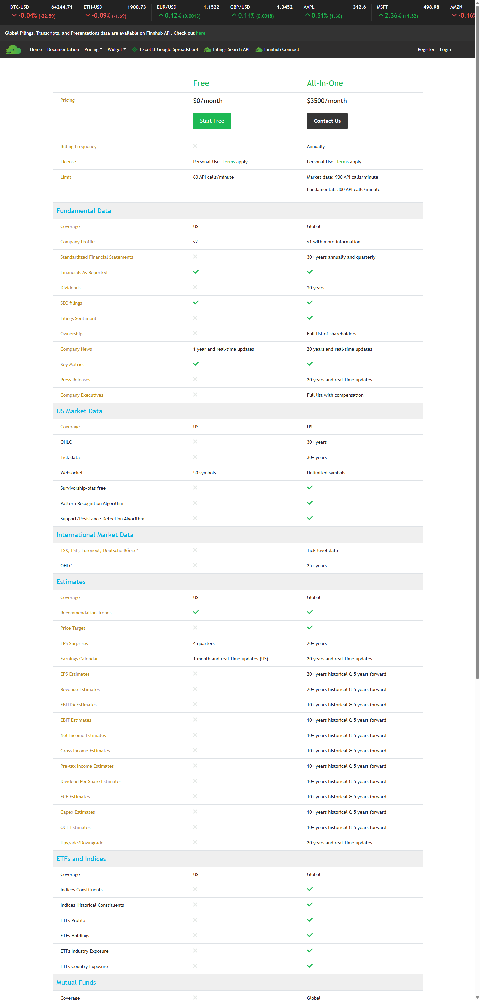
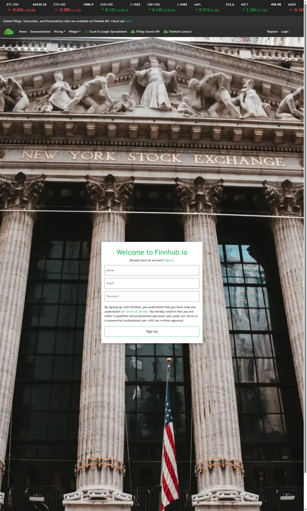
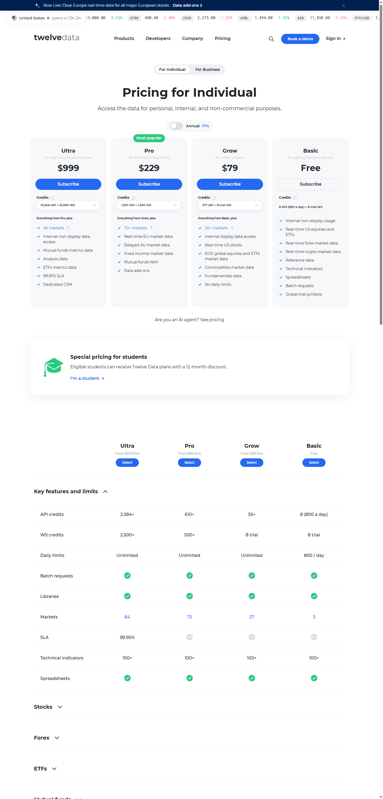
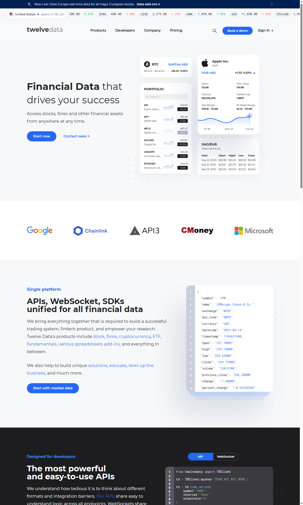

# 免费行情 API Key 注册指南（Finnhub / Twelve Data）

> 用途：本看板目前以 Yahoo 非官方接口为主数据源，稳定性一般。拿到正规 API Key 后可以接入为新的数据源 Provider，提升盘中/盘前盘后数据的准确性与稳定性。
>
> **一句话结论：推荐先注册 Finnhub。** 免费额度高（60 次/分钟），且盘中实时报价齐全；Twelve Data 免费档**不含实时盘前盘后数据**（详见下文），只能作为盘中数据的备选。

---

## 一、Finnhub（推荐）

### 1. 免费档能拿到什么

| 项目 | 免费档（Free） |
|---|---|
| 价格 | $0 / 月 |
| 频率限制 | 60 次 API 调用 / 分钟 |
| 美股实时报价 | ✅ 有（US Market Data） |
| 盘前 / 盘后报价 | 官方未明确标注免费档是否包含，**需注册后实测**（方法见第 4 步） |
| 用途限制 | 仅限个人非商用（Personal Use） |
| 信用卡 | 不需要 |



对本项目来说 60 次/分钟意味着：20 个板块、约 150 只成分股，用批量/分批轮询完全够用（配合现有 5 分钟缓存策略更是绰绰有余）。

### 2. 注册步骤（约 1 分钟）

1. 打开注册页：<https://finnhub.io/register>
2. 填写 **Name**（姓名）、**Email**（邮箱）、**Password**（密码），点击 **Sign Up**：



3. 部分情况下会要求到邮箱点验证链接，按提示完成即可。
4. 注册后无需选套餐，默认就是 Free 档。

### 3. 获取 API Key

注册完成后登录 <https://finnhub.io>，进入 **Dashboard**（控制台）页面，**页面顶部就是 "API Key" 一栏**，点击旁边的 Copy 按钮复制即可。形如：

```
d2xxxxxxxxxxxxxxxxxxxxxxx
```

### 4. 验证 Key 是否可用

把下面命令里的 `你的KEY` 替换成实际 Key，在终端执行：

```bash
curl "https://finnhub.io/api/v1/quote?symbol=NVDA&token=你的KEY"
```

正常返回示例：

```json
{"c":221.28,"d":9.35,"dp":4.41,"h":223.5,"l":208.1,"o":210.0,"pc":211.93,"t":1754404800}
```

字段含义：`c` 最新价、`dp` 涨跌幅 %、`pc` 前收盘价。

**盘前盘后实测方法**：在美股盘前时段（美东 4:00–9:30）再执行一次上面的命令，观察 `c`（最新价）是否跟随盘前价格变动、`dp` 是否相对前收盘计算盘前涨幅。如果盘前数据在免费档可用，返回值会随盘前行情跳动；如果一直停在昨收价，则说明免费档不含盘前盘后。

### 5. 注意

- Key 属于个人凭证，**不要提交到 git、不要发给他人**。
- 免费档仅限个人非商用使用。
- 国内网络访问 finnhub.io 一般可用，如打不开请自备网络工具。

---

## 二、Twelve Data（备选）

### 1. 免费档能拿到什么

| 项目 | 免费档（Basic） |
|---|---|
| 价格 | $0 |
| 频率限制 | 8 credits / 分钟，800 credits / 天 |
| 美股盘中报价 | ✅ 有（实时） |
| **盘前 / 盘后实时报价** | ❌ **没有！`prepost=true` 需要 Pro 档（$229/月）起** |
| 历史盘前盘后数据 | ✅ 可查询（免费档可用，但非实时） |
| 信用卡 | 不需要 |

> ⚠️ **重要提醒**：Twelve Data 官网把 "real-time pre/post market data" 放在 Pro 及以上套餐。免费档在盘前/盘后时段只会返回盘中收盘价。所以它**不能解决本项目盘前盘后显示的需求**，只适合做盘中时段的备份数据源。
> 依据：Twelve Data 官方支持文档 <https://support.twelvedata.com/en/articles/5195429-pre-post-market-data>



### 2. 注册步骤（约 1 分钟）

1. 打开官网 <https://twelvedata.com>，点击首页的 **"Start now"** 按钮（或右上角 Sign In 旁的注册入口）：



2. 填写邮箱 + 密码注册，也可以直接用 Google 账号一键登录。
3. 注册后默认即为 Basic（Free）档，无需绑卡。

### 3. 获取 API Key

登录后进入 **Dashboard**（控制台）首页，页面上会直接显示你的 **API Key**（一串 32 位十六进制字符），点击复制即可。

### 4. 验证 Key 是否可用

```bash
curl "https://api.twelvedata.com/quote?symbol=NVDA&apikey=你的KEY"
```

正常返回会包含 `symbol`、`name`、`close`、`percent_change` 等字段。

### 5. 注意

- 每天 800 次的上限意味着轮询频率必须控制（150 只股票每 5 分钟刷一轮，一天最多支撑约 5 轮全量刷新），更适合做**备份源**而非主源。
- Key 同样不要泄露、不要提交 git。

---

## 三、拿到 Key 之后怎么接入本看板

本项目的数据源走的是 Provider 抽象层（`app/providers/` 目录，现有 `yahoo.py`、`sina.py`），新增数据源只需：

1. 新建 `app/providers/finnhub.py`，实现统一的报价接口（最新价、涨跌幅、盘前/盘后字段）；
2. 在 Provider 链上配置优先级（例如：Finnhub 为主 → Yahoo 兜底）；
3. Key 通过**环境变量**注入（如 `FINNHUB_API_KEY`），不写死在代码里——`.env.example` 里已有先例。

**拿到 Key 后直接发给我，我来做接入和验证。** 盘前盘后时段各验一次，确认数据口径与现有「盘中/盘前/盘后」展示逻辑一致后再切换上线。

---

## 四、对比速查

| | Finnhub Free | Twelve Data Basic |
|---|---|---|
| 盘中实时报价 | ✅ | ✅ |
| 盘前盘后实时 | 待实测（大概率有） | ❌（需 $229/月起） |
| 频率 | 60 次/分钟 | 8 次/分钟 + 800 次/天 |
| 信用卡 | 不需要 | 不需要 |
| 适合本项目的角色 | **主力源候选** | 盘中备份源 |
